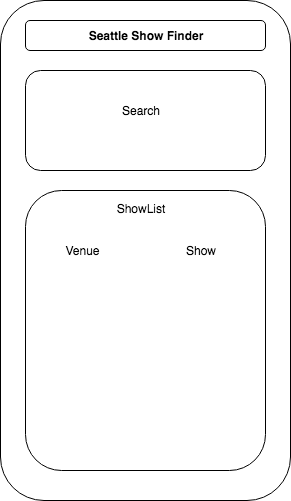
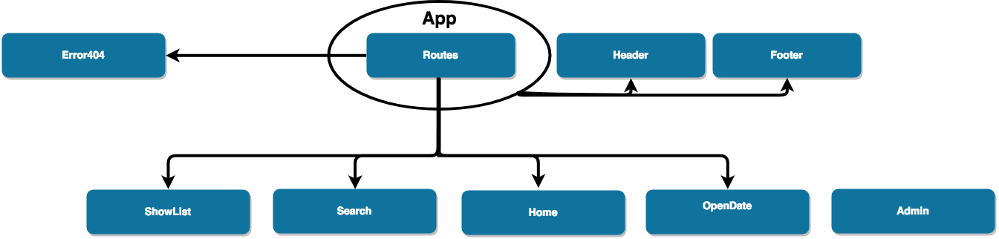

Show Finder Planning (incomplete * school project)

#### Epicodus Capstone Project, 9/21/2018

### By Hisato Kawaminami

## Description

This app allows a user to find a list of shows at local music venues for the date searched

## Installation
Clone from:https://github.com/hisatokawaminami/central-saloon-react.git

## Specifications
-A user can select a date
-A list of shows will be displayed for the selected date  

## Technologies Used

* _React_
* _Javascript_
* _JSX_
* _Babel_
* _npm_
* _CSS_

## Development server
Run `npm install` in a terminal
Run `npm run start` for a dev server. Navigate to `http://localhost:8080/`. The app will automatically reload if you change any of the source files.

## App Layout

## Component Structure

## README Prompts

## Project Proposal
Name of Student: Hisato Kawaminami

Name of Project: Live Music Show Finder
Project’s Purpose or Goal: (What will it do for users?):
- To gather a list of shows from local music venues for a selected date

List the absolute minimum features the project requires to meet this purpose or goal:
- A user can select a date and then a show from a venue be displayed

What tools, frameworks, libraries, APIs, modules and/or other resources (whatever is specific to yourtrack, and your language) will you use to create this MVP? List them all here. Be specific.
- JavaScript
- React
- APIs

If you finish developing the minimum viable product (MVP) with time to spare, what will you work on next? Describe these features here: Be specific.

- Scrape data from multiple venues and add the info to the show list
If there is no show listed on the venue’s websites, make those dates can be searchable for bands to find out what dates the venues have open for booking a potential show

Is there anything else you’d like your instructor to know?
I haven’t had a chance to look into how I can make this happen yet, but I will find some time and do a research
